 
>##  Desafio de React (wefit - digital service design)


[DEPLOY DO PROJETO](https://teste-tecnico-indol.vercel.app/)


> ## 📄 como rodar (develop - versão com json-server)
```bash
npm i
npm run json-server
npm run dev
```

> ## 📄 como rodar (main - versão com mockapi)
```bash
npm i
npm run dev
```

> ## 📁 arquitetura do projeto
```shell

src/
|-- pages/(paginas_da_aplicão)
|   |-- home/
|   |-- Cart/
|   |-- PurchaseMade/
|   |   |-- index (view)
|   |   |-- model (hook)
|   |   |-- style (estilo)
|-- Service/(camada_de_acesso)
|   |-- api/ (intancia)
|   |-- http/ (request)
|   |-- query/ (query-do-react-query)
|   |-- mutate/ (mutate-do-react-query)
|-- main/(camada_de_entrada_da_aplicão)
|   |-- main
|   |-- index.css
|-- components/(componentes_da_UI)
|   |-- button/
|   |-- CardProduct/
|   |   |-- CardProduct.stories(doc_do_componente)
|   |   |-- index.tsx(view)
|   |   |-- styles(estilos)
|-- models/(interfaces_do_sistema)
|   |-- Product(interfaces)
|-- routes/(rotas_da_aplicão)
|   |-- index(rotas)
|   |-- path(enderecos_das_rotas)
|-- layout/(componentes_que_ficam_ao_redor_como_header)
|   |-- index
|-- context/(criando_contexto_para_o_carrinho)
|   |-- index
|-- Theme/(detalhes_sobre_estilos)
|   |-- color(cores_da_aplicão)
|   |-- devices(tamanho_dos_dispositivos)
 
```

>>## 🛠️ libs usadas 
- [`react-query`](https://tanstack.com/query/latest)
- [`axios`](https://axios-http.com/docs/intro)
- [`react-router-dom`](https://reactrouter.com/en/main)
- [`styled-components`](https://styled-components.com/docs)
- [`json-server`](https://www.npmjs.com/package/json-server)
- [`react-icons`](https://react-icons.github.io/react-icons/)


>## 📸 imagens do projeto

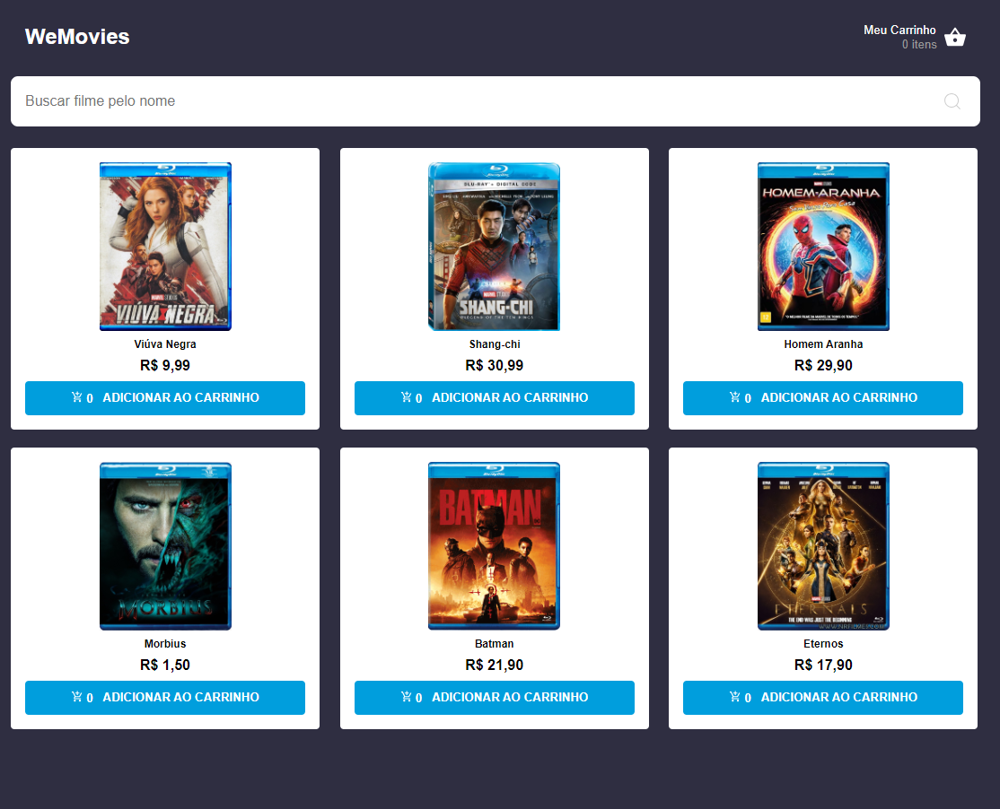
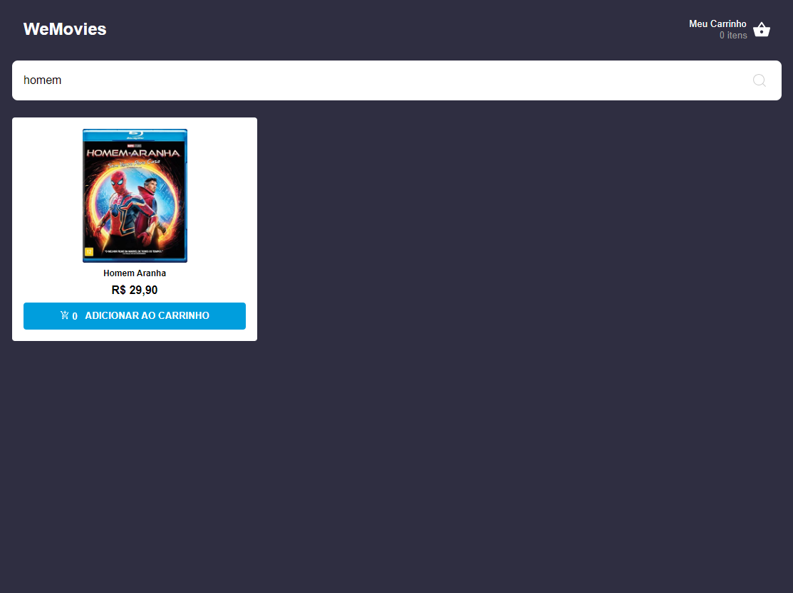
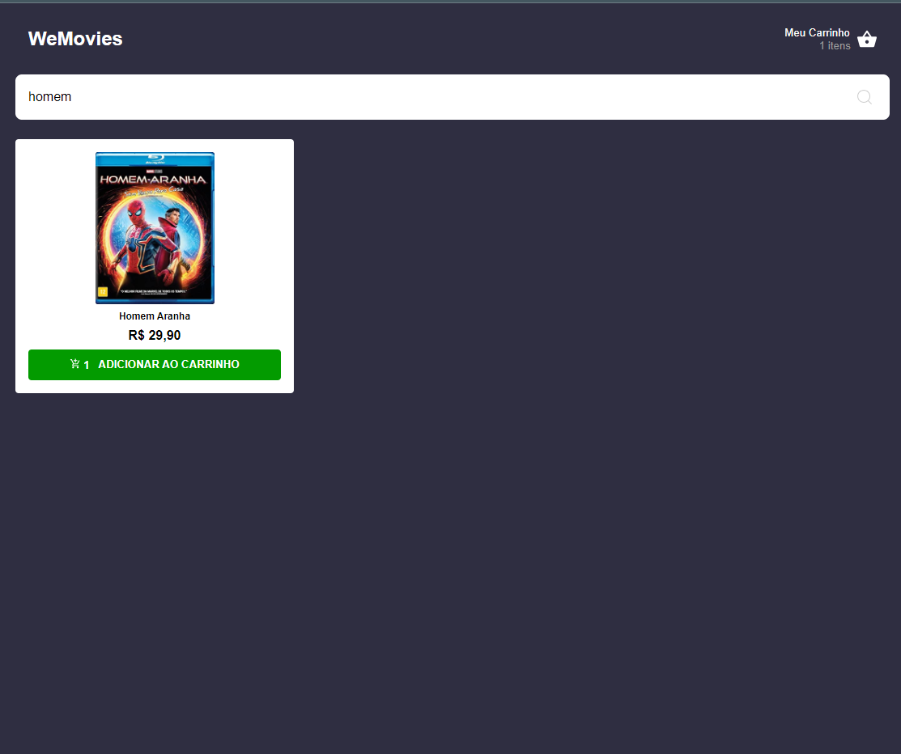
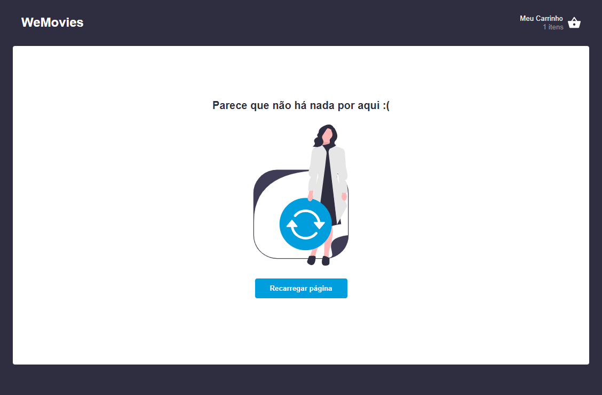
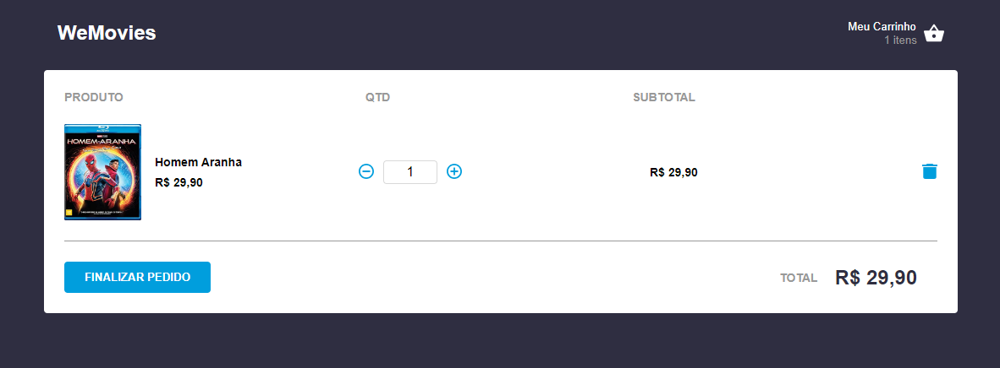
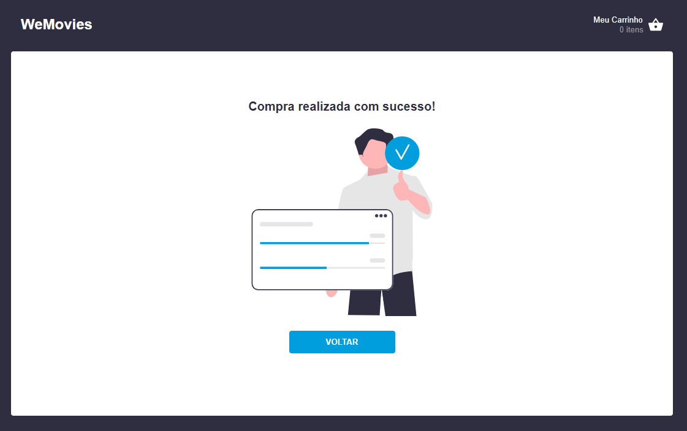 
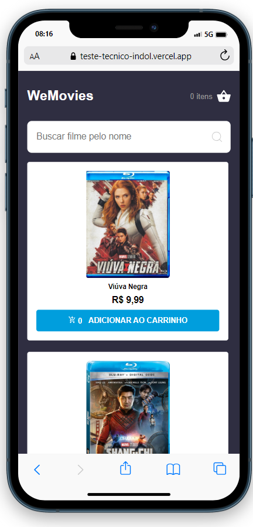 
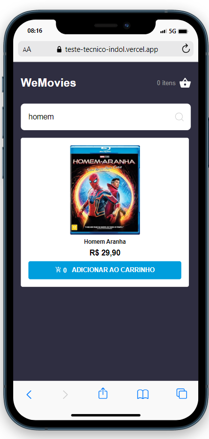 
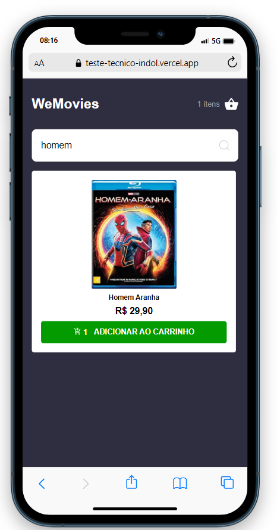 
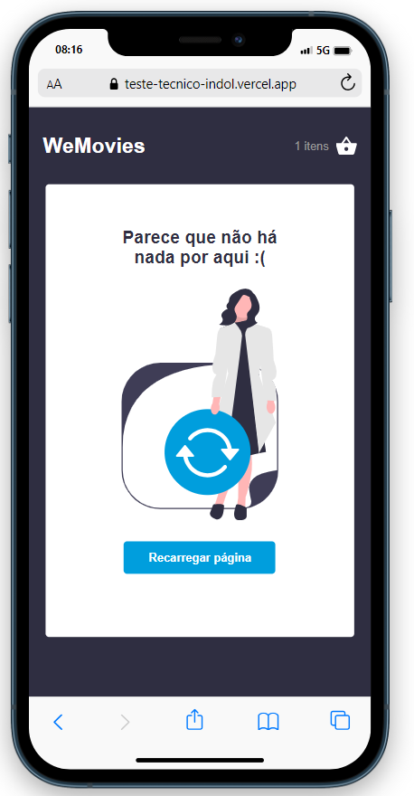 
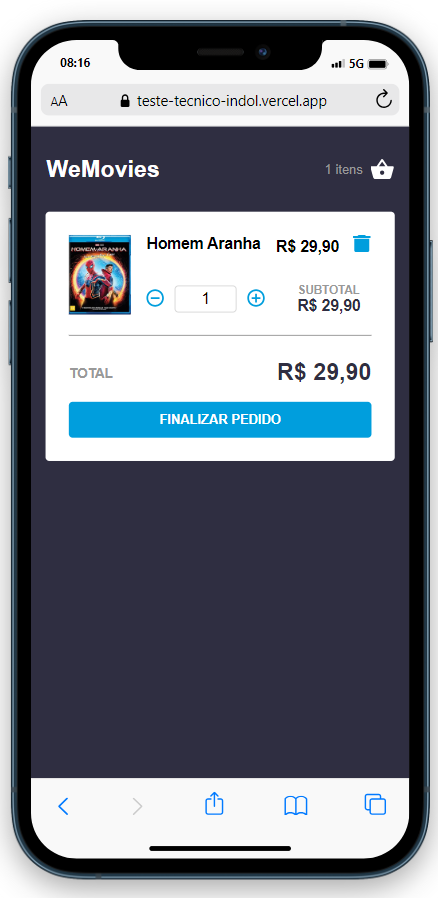 
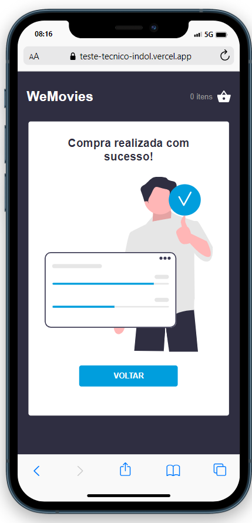 
